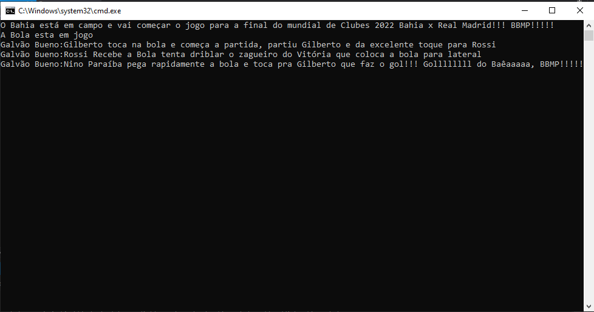
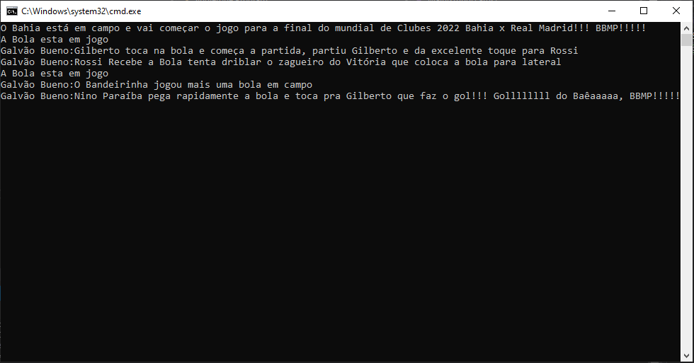

# Design Partterns - Singleton
*Singleton* é um padrão de projeto de Criação, por principio padrões de projetos de Criação tem como  objetivo controlar a instanciação de objetos . Padrões de Projetos de Criação são importantíssimos em um dos princípios mais importantes de OO .

> *"Program to an interface , not an implementation"*

O Singleton tem como objetivo principal resolver os seguintes problemas:

- Controlar o acesso as instancias das classes garantindo que seja que uma classe seja instanciada uma única vez;
- Reduzir a utilização de memória;
- Tornar o código mais flexivel.

> "Como garantimos que uma classe tenha somente uma instância e que essa instância seja facilmente acéssivel?"

> Gamma Erich , Padrões de projeto: soluções reutilizaveis de software orientado a objetos ,2000 p 130


De uma maneira muito objetiva como funciona o singleton? O Singleton proporciona que o a instancia de uma determinada classe seja reutilizada, reduzindo a necessidade de uma nova instancia a todo momento que a classe seja necessitada no sistema. Fazendo uma analogia com o mundo real , um jogo de futebol por regra só pode ocorrer somente com uma Bola em campo , quando existem duas bolas em campos o jogo pode ser parado para a retirada da segunda bola. Isso é singleton!!!!


Use o padrão quando:

- for preciso haver uma única instância de uma classe, e essa instância tiver que dar acesso através de um ponto conhecido;
- a única instância tiver de ser extensível através de subclasses , possibilite que aos clientes que essa instância possa ser usada de maneira estendida sem alterar o código.

Imaginando isso e a real possibilidade da Final do Mundial de Clubes 2022 ser Bahia e Real Madrid, apliquei a implementação do *Singleton* na narração de Galvão Bueno. Para esse teste criei um projeto do tipo Console chamado *singleton* .

Criei uma classe chamada Ball , que será representação do objeto *singleton*. Criei um atributo estático do tipo da própria classe, esse objeto será responsável pelo controle da instância ativa e foi criado um método *GetInstanceWithSingleton* responsável pelo acesso e verificação da instância ativa 


```
 public class Ball
 {
        private static Ball instance = null;


        public static Ball GetInstanceWithSingleton()
        {
            if(instance == null)
            {
                instance  = new Ball();
                Console.WriteLine("A Bola esta em jogo");
              
            }
            return instance;
        }


        
        public void Message(string message)
        { 
            Console.WriteLine(message);
        }
    }
```

Na classe *Program* do console instanciei 3 objetos do tipo *ball* e somente foi exibida uma única vez a Mensagem a Bola está em jogo, o que representa que somente uma única vez o objeto Ball foi criado os demais reutilizaram a instância criada.

```
class Program
    {
        static void Main(string[] args)
        {
            Console.WriteLine("O Bahia está em campo e vai começar o jogo para a final do mundial de Clubes 2022 Bahia x Real Madrid!!! BBMP!!!!!");
            Ball ball1 = Ball.GetInstanceWithSingleton();
            ball1.Message("Galvão Bueno:Gilberto toca na bola e começa a partida, partiu Gilberto e da excelente toque para Rossi");
            
            
            Ball ball2 = Ball.GetInstanceWithSingleton();
            ball2.Message("Galvão Bueno:Rossi Recebe a Bola tenta driblar o zagueiro do Vitória que coloca a bola para lateral");


            Ball ball3 = Ball.GetInstanceWithSingleton();
            ball3.Message("Galvão Bueno:Nino Paraíba pega rapidamente a bola e toca pra Gilberto que faz o gol!!! Gollllllll do Baêaaaaa, BBMP!!!!!");


            Console.ReadKey();
        }
    }
```



Para entender a diferença entre a utilização do *singleton* e uma classe sem sua utilização , criei um novo método estático de nome *GetInstanceWithoutSingleton* onde esse não está implementado o *Design Patterns Singleton* e vamos ver o resultado instanciando um novo objeto *Ball* a partir desse método.

```
 public static Ball GetInstanceWithoutSingleton()
            {
                instance = new Ball();
                Console.WriteLine("A Bola esta em jogo");


                return instance;
            }
```

```
class Program
    {
        static void Main(string[] args)
        {
            Console.WriteLine("O Bahia está em campo e vai começar o jogo para a final do mundial de Clubes 2022 Bahia x Real Madrid!!! BBMP!!!!!");
            Ball ball1 = Ball.GetInstanceWithSingleton();
            ball1.Message("Galvão Bueno:Gilberto toca na bola e começa a partida, partiu Gilberto e da excelente toque para Rossi");
            
            
            Ball ball2 = Ball.GetInstanceWithSingleton();
            ball2.Message("Galvão Bueno:Rossi Recebe a Bola tenta driblar o zagueiro do Vitória que coloca a bola para lateral");


            Ball ball4 = Ball.GetInstanceWithoutSingleton();
            ball4.Message("Galvão Bueno:O Bandeirinha jogou mais uma bola em campo");


            Ball ball3 = Ball.GetInstanceWithSingleton();
            ball3.Message("Galvão Bueno:Nino Paraíba pega rapidamente a bola e toca pra Gilberto que faz o gol!!! Gollllllll do Baêaaaaa, BBMP!!!!!");


            Console.ReadKey();
        }
    }
```

E o resultado exibido no console foi que a "A bola está em jogo" agora aparece duas vezes, o que representa que um novo objeto de *Ball* foi instanciado:




Esse foi o padrão singleton, espero que tenham gostado desse artigo. Muito obrigado.

Referência

- Gamma Erich , Padrões de projeto: soluções reutilizaveis de software orientado a objetos ,2000, Editora bookman
